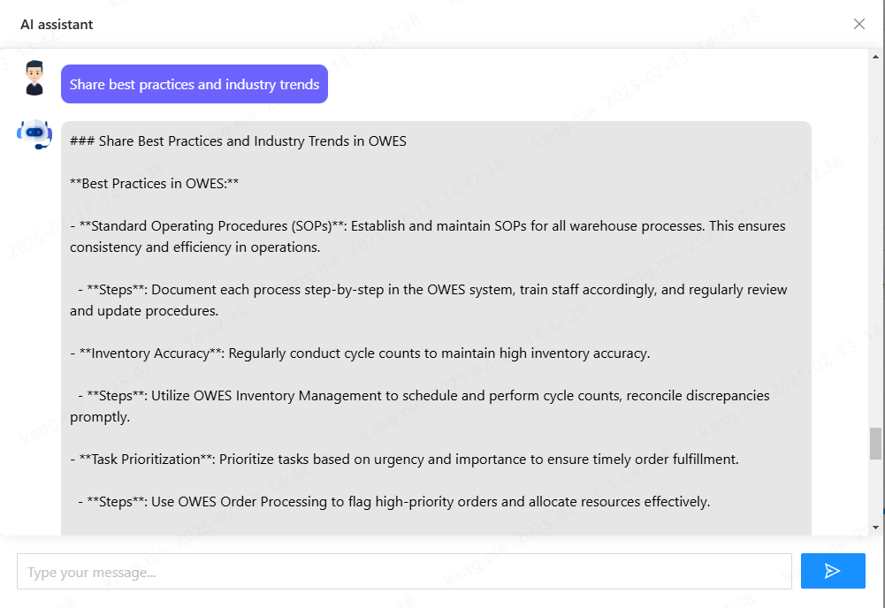
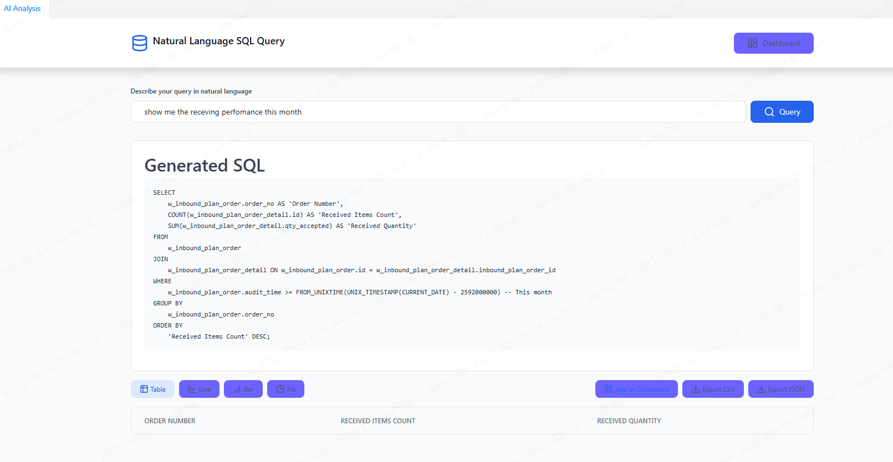

As businesses increasingly rely on advanced data analytics and machine learning for decision-making, integrating
powerful AI models into existing systems becomes essential. One such powerful integration is combining **Spring AI**, a
framework for building AI-powered applications with Spring, with **DeepSeek**, a large language model.

In this post, we’ll walk through the integration of Spring AI with DeepSeek, explaining the key concepts, benefits, and
a step-by-step guide on how to make this integration work seamlessly.

### What is Spring AI?

[Spring AI](https://spring.io/projects/spring-ai) is a framework that allows developers to create AI applications with
the power and flexibility of the Spring ecosystem. It provides the tools and capabilities to integrate large language
models into Spring-based applications, making it easier for developers to build and deploy AI-powered solutions without
the steep learning curve.

### Why Integrate Spring AI with DeepSeek?

Combining Spring AI with DeepSeek opens up a world of possibilities for your application, allowing you to:

* **Access to Advanced Language Models**: Integrate DeepSeek's state-of-the-art models into your Spring-based
  applications, enhancing natural language understanding and generation.

* **Real-Time AI Responses**: Combine DeepSeek's powerful AI models with Spring's backend services to deliver
  intelligent, real-time responses within your application.

* **Scalable AI Solutions**: Build AI systems that scale with your business needs using Spring’s robust infrastructure
  and DeepSeek’s advanced language models.

### Prerequisites

Before diving into the integration process, ensure you have the following prerequisites:

* **Spring Boot**: A running Spring Boot application, as Spring AI is built on top of it.
* **DeepSeek API Key**: Access to DeepSeek’s API for leveraging its models and services.
* **Java 17+**: Since Spring AI works best with Java 17 and higher.

### Step-by-Step Integration Guide

#### Step 1: Set up Your Spring Boot Application

If you don’t have a Spring Boot application set up already, you can create one using the [Spring Initializr](https://start.spring.io/). Select
dependencies such as **Spring Web**, **Spring Boot DevTools**, and **Spring AI**.

```
curl https://start.spring.io/starter.zip -d dependencies=web,devtools -d name=SpringDeepSeek -o SpringDeepSeek.zip` 
```

#### Step 2: Add Dependencies

In your `build.gradle` file, add the necessary dependencies for Spring AI and DeepSeek. For Spring AI, 
use the `spring-ai-openai-spring-boot-starter` dependency. Since Spring AI doesn’t have a specific client for DeepSeek, 
you can interact with OpenAI API directly.

Example:

```
implementation 'org.springframework.ai:spring-ai-openai-spring-boot-starter'

```

#### Step 3: Configure DeepSeek API

To interact with DeepSeek, you’ll need an API key. Add your key to `application.properties` or `application.yml` for
secure access.

```
spring:
  ai:
    openai:
      base-url: https://api.deepseek.com 
      api-key: xxx
      chat:
        options:
          model: deepseek-chat
          temperature: 0    
      embedding:
        enabled: false      
```

#### Step 4: Implement DeepSeek Integration

Create a service that interacts with DeepSeek’s API to retrieve data insights

```
@Service
public class AiChatService {

    private final ChatModel chatModel;

    private Flux<String> executeAI(String message, String conversationId, PromptTemplate template) {

        String relevantHistory = chatMemory.get(conversationId, 10)
                .stream()
                .map(this::formatMessage)
                .collect(Collectors.joining("\n"));

        // Add context to template
        template.add("context", relevantHistory);

        chatMemory.add(conversationId, new UserMessage(message));

        // Create a StringBuilder to accumulate the response
        StringBuilder fullResponse = new StringBuilder();

        return this.chatModel.stream(template.createMessage()).map(chunk -> {
            fullResponse.append(chunk);
            return chunk;
        }).doOnComplete(() -> {
            // Only save to chat memory once we have the complete response
            chatMemory.add(conversationId, new AssistantMessage(fullResponse.toString()));
        });
    }
}
```

#### Step 5: Combine Spring AI and DeepSeek

Now, combine both services to allow your application to use the insights from DeepSeek and apply them to your AI model.

```@RestController
@RequestMapping("/ai")
public class AIController {

    @GetMapping("chat")
    public Flux<String> chat(@RequestParam(value = "message") String message) {
        String currentUser = UserContext.getCurrentUser();
        return aiService.chat(message, currentUser);
    }

    @PostMapping("analysis")
    @CrossOrigin
    public AnalysisResult sqlAnalysis(@RequestBody AnalysisQueryVO analysisQueryVO) throws SQLException {
        String currentUser = UserContext.getCurrentUser();
        return aiService.analysis(analysisQueryVO.getQuery(), currentUser);
    }

    @PostMapping("generateJsFunction")
    @CrossOrigin
    public Flux<String> generateJsFunction(@RequestBody JsFunctionGenerationRequest jsFunctionGenerationRequest) {
        String currentUser = UserContext.getCurrentUser();
        return aiService.generateJsFunction(jsFunctionGenerationRequest, currentUser);
    }

    @PostMapping("generateCode")
    @CrossOrigin
    public Flux<String> generateCode(@RequestBody CodeGenerationRequest codeGenerationRequest) {
        String currentUser = UserContext.getCurrentUser();
        return aiService.generateCode(codeGenerationRequest, currentUser);
    }
}

```

#### Step 6: Test the Integration

Start your Spring Boot application and test the integration by calling the API endpoint:

```
curl "http://localhost:8080/ai/chat?message=some_data_to_analyze"
```

You should receive a response that includes data from DeepSeek and the analysis from your AI model.

#### Step 7: Some Use cases

###### AI Assistance:
AI Assistance uses AI models to provide automated, real-time responses or insights based on user input. It helps users by answering queries, offering suggestions, or assisting with tasks, enhancing efficiency in applications like customer support or virtual assistants.


###### AI Data Analysis
AI Data Analysis enables AI models to process and extract insights from large datasets. It identifies patterns and trends, aiding data-driven decision-making. This is crucial for applications where analyzing data quickly and accurately leads to better business outcomes.


### Conclusion

Integrating **Spring AI** with **DeepSeek** offers a robust solution for building AI-powered applications that can
analyze large datasets, make real-time decisions, and scale with your business needs. With this setup, you can harness
the power of deep learning and machine learning to improve your warehouse execution system or any other data-driven
application.
  
You can explore the project further at [GitHub](https://github.com/jingsewu/open-wes) and find more information in the **modules-ai** section.

Feel free to customize the steps and models used according to your project’s specific requirements.
