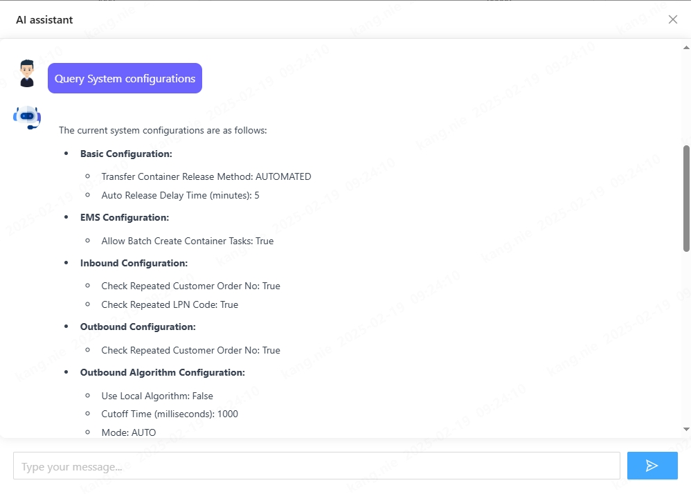
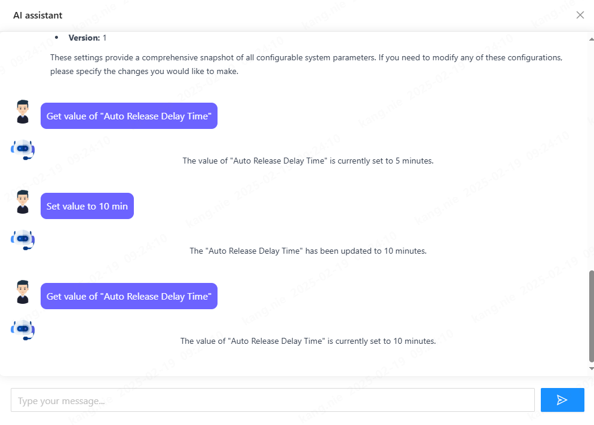

System configuration management is typically handled through configuration files, environment variables, or admin interfaces. But what if we could change system settings simply by chatting with our application? In this article, I'll show you how to build a chatbot that can understand and modify system configurations using natural language, powered by Spring AI.

## The Power of Natural Language Configuration

Traditional configuration management requires users to:
- Know exact parameter names and valid values
- Navigate through configuration files or interfaces
- Understand technical syntax and formatting

By using natural language processing, we can make this process more intuitive. Users can simply say things like "increase the connection timeout to 30 seconds" or "enable debug logging for the authentication module."

## Technical Implementation

### Setting Up Spring AI

look the article: [Integrate-SpringAI-with-DeepSeek](./2025-02-14-Integrate-SpringAI-with-DeepSeek.md)

### Defining Tool Functions

Spring AI supports tool functions that allow the AI model to take specific actions. We'll define functions for reading and updating configurations:

```java
@Service
@RequiredArgsConstructor
public class SystemConfigTool implements ITool {

    private final ISystemConfigApi systemConfigApi;

    @Tool(name = "getSystemConfig", description = "Retrieves the current system configuration settings, including basic, EMS, inbound, outbound, stock, and algorithm configurations. The returned {@link SystemConfigDTO} provides a comprehensive snapshot of all configurable system parameters.")
    public SystemConfigDTO getSystemConfig() {
        return systemConfigApi.getSystemConfig();
    }

    @Tool(name = "updateSystemConfig", description = """
            update System configuration settings，using JSON structure below：
            {
              "basicConfig": {
                "transferContainerReleaseMethod": "AUTOMATED|MANUAL",  
                "autoReleaseDelayTimeMin": number                      
              },
              "inboundConfig": {
                "checkRepeatedCustomerOrderNo": boolean,  
                "checkRepeatedLpnCode": boolean          
              },
              "outboundConfig": {
                "checkRepeatedCustomerOrderNo": boolean   
              },
              "stockConfig": {
                "stockAbnormalAutoCreateAdjustmentOrder": boolean,  
                "zeroStockSavedDays": number                        
              },
              "emsConfig": {
                "allowBatchCreateContainerTasks": boolean           
              },
              "outboundAlgoConfig": {
                "useLocalAlgorithm": boolean,        
                "cutoffTime": number,                
                "mode": "string",                    
                "orderDispatchStrategy": "string"    
              }
            }
            Example:
            - "Disable duplicate order check for inbound orders" → {"inboundConfig":{"checkRepeatedCustomerOrderNo":false}}
            - "Set zero stock retention period to 3 days" → {"stockConfig":{"zeroStockSavedDays":3}}
            - "Modify container release method and algorithm timeout simultaneously" → {
                             "basicConfig":{"transferContainerReleaseMethod":"MANUAL"},
                                "outboundAlgoConfig":{"cutoffTime":5000}
                            }
            """)
    public void updateSystemConfig(@ToolParam SystemConfigDTO systemConfigDTO) {
        systemConfigApi.update(systemConfigDTO);
    }
}
```

### Integrating Tools into Chatbot Service

The chatbot service will handle the natural language processing:

```java

private final List<ITool> tools;

private String executeAIAndReturnString(String message, String conversationId, PromptTemplate template) {

    String relevantHistory = chatMemory.get(conversationId, 10)
            .stream()
            .map(this::formatMessage)
            .collect(Collectors.joining("\n"));

    template.add("context", relevantHistory);

    chatMemory.add(conversationId, new UserMessage(message));

    String content = ChatClient.create(chatModel).prompt(template.create()).tools(tools.toArray()).call().content();
    chatMemory.add(conversationId, new AssistantMessage(content));

    return content;

}
```
I created an interface **ITool** to unify all the tool functions.

```java
    @Override
    public String chat(String message, String conversationId) {

        PromptTemplate template = new PromptTemplate(AiPromptTemplate.QA_QUESTION_CLARIFY_TEMPLATE);
        template.add("question", message);
        String intent = ChatClient.create(chatModel).prompt(template.create())
                .call().content();

        if ("1".equals(intent)) {
            template = new PromptTemplate(AiPromptTemplate.QA_PROMPT_TEMPLATE);
            template.add("question", message);
            template.add("language", LanguageContext.getLanguage());

        } else {
            template = new PromptTemplate(QA_TOOL_CALL_TEMPLATE);
            template.add("question", message);
            template.add("language", LanguageContext.getLanguage());
        }

        return executeAIAndReturnString(message, conversationId + "chat", template);
    }
```

**Attention: The chatbot has two functions: first, it serves as a Q&A chatbot; second, it acts as a configuration management chatbot. Therefore, there is a judgment to determine whether the question is a Q&A query or a configuration management query before calling the LLM**

## Example Interactions

Here are some example interactions with the chatbot:

First, I input "Query System Configurations" then the chatbot will return the current system configuration settings.


I input 'Get value of Auto Release Delay Time,' and the chatbot returns the current value. Then, I input 'Set value to 10 min' to update it. The chatbot confirms the change by returning the new value.

## Security Considerations

When implementing this type of system, consider these security aspects:

1. Authentication and Authorization
  - Ensure only authorized users can access the configuration chatbot
  - Implement role-based access control for different configuration categories

2. Validation and Constraints
  - Add validation rules for configuration values
  - Implement constraints to prevent critical system settings from being modified

3. Audit Logging
  - Log all configuration changes
  - Record who made the change and when

## Benefits and Use Cases

This approach to configuration management offers several advantages:

1. Improved User Experience
  - Natural language interaction reduces the learning curve
  - Users don't need to remember exact configuration keys
  - Faster configuration changes without navigating complex interfaces

2. Reduced Human Error
  - The AI can validate and sanitize inputs
  - Immediate feedback on invalid configurations
  - Guided experience for complex settings

3. Perfect for DevOps and System Administration
  - Quick configuration changes during deployments
  - Easier troubleshooting and system maintenance
  - Reduced documentation needs

## Other Use Cases with function call
- Customer Support: Automatically create support tickets, fetch order details, or provide FAQs.

- E-commerce: Recommend products, process payments, or track shipments.

- Healthcare: Schedule appointments, retrieve patient records, or send medication reminders.

- Finance: Fetch account balances, perform transactions, or provide investment insights.
## Conclusion

By combining Spring AI with system configuration management, we've created a more intuitive and user-friendly way to manage application settings. This approach shows how AI can simplify traditional technical tasks and make them accessible to a broader audience.

The complete source code for this project is available on GitHub [OpenWES](https://github.com/jingsewu/open-wes). Feel free to try it out and adapt it to your needs!

Remember to handle edge cases, add proper error handling, and implement security measures before using this in a production environment.
