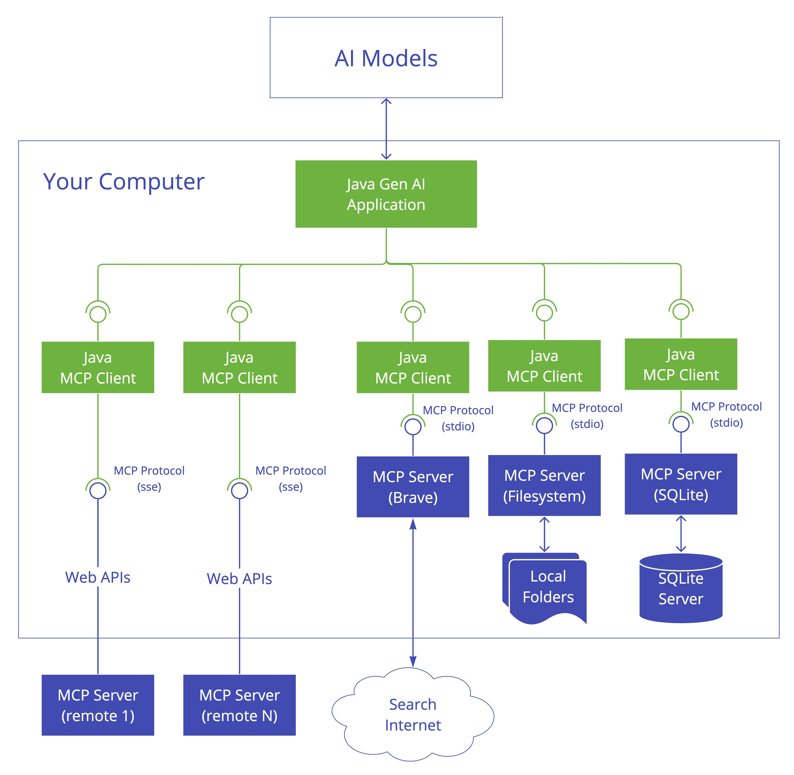
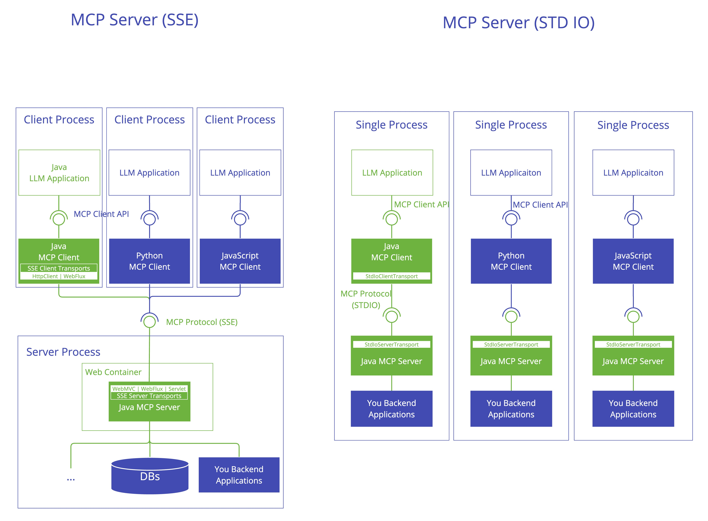

---

### **Building Intelligent Applications with Model Context Protocol (MCP) and Spring AI**

#### **1. Introduction to MCP Architecture**
MCP (Model Context Protocol) standardizes interactions between AI applications and external data sources, enabling seamless integration of tools like databases, APIs, and search engines. Its client-server architecture comprises:
- **MCP Host**: The AI application layer (e.g., Claude chatbot) that users interact with.
- **MCP Client**: Handles communication between the host and servers, formatting requests for external systems.

- **MCP Server**: Middleware that connects to external resources (e.g., PostgreSQL, Google Drive) and executes operations .


---
#### **2. Install mysql MCP Server**
**Step 1: You can check out this github repository： https://github.com/designcomputer/mysql_mcp_server**  
Using Manual Installation
```shell
pip install mysql-mcp-server
```  

**Step 2: Causing we will use uv tool, then we should install it**  
follow this article: https://docs.astral.sh/uv/getting-started/installation/#installation-methods and install uv


#### **3. Project Setup with Spring AI**
**Step 1: Add Dependencies**  
Include Spring AI MCP libraries in `build.gradle`:
```groovy
    implementation 'org.springframework.ai:spring-ai-mcp-client-spring-boot-starter'  
    implementation 'org.springframework.ai:spring-ai-mcp-client-webflux-spring-boot-starter' // For SSE transport
```  
Configure repositories for milestone builds .

---


#### **4. Client Integration**
**Step 1: Configure Spring AI configuration in application.yml**  
```yaml
spring:
  ai:
    mcp:
      client:
        enabled: true
        name: mysqlMCP # MCP server name
        version: 1.0.0
        type: SYNC
        request-timeout: 20s
        stdio:
          root-change-notification: true
          servers-configuration: classpath:mcp-servers-config.json # MCP server config such/same as claude desktop configs.
```  

**Step 2: Add mcp-servers-config.json**  
```json
{
  "mcpServers": {
    "mysql": {
      "command": "C:\\Users\\xxx\\.local\\bin\\uv.exe",
      "args": [
        "--directory",
        "C:\\Users\\xxx\\AppData\\Local\\Programs\\Python\\Python311\\Lib\\site-packages\\mysql_mcp_server",
        "run",
        "mysql_mcp_server"
      ],
      "env": {
        "MYSQL_HOST": "localhost",
        "MYSQL_PORT": "3306",
        "MYSQL_USER": "root",
        "MYSQL_PASSWORD": "root",
        "MYSQL_DATABASE": "test"
      }
    }
  }
}
```  
you should check the directories of the uv.exe and mysql_mcp_server,
and check all mysql configurations.

---

#### **5. Simple Example**
The example will use MCP to interact with a MySQL database.
```java
@SpringBootApplication(scanBasePackages = "org.openwes")
@EnableDiscoveryClient
public class AiApplication {

    public static void main(String[] args) {
        SpringApplication.run(AiApplication.class, args);
    }

    private String userInput = "show all tables";

    @Bean
    public CommandLineRunner predefinedQuestions(ChatClient.Builder chatClientBuilder, ToolCallbackProvider tools,
                                                 ConfigurableApplicationContext context) {
        return args -> {

            var chatClient = chatClientBuilder
                    .defaultTools(tools)
                    .build();

            System.out.println("\n>>> QUESTION: " + userInput);
            System.out.println("\n>>> ASSISTANT: " + chatClient.prompt(userInput).call().content());

            context.close();
        };
    }

}
```
Then we will see logs that show it change natural language *show all tables* to SQL *show all tables*:
```shell
received: 2025-03-27 09:21:19,799 - mysql_mcp_server - INFO - Listing tools...

>>> QUESTION: show all tables

received: 2025-03-27 09:21:20,602 - mysql_mcp_server - INFO - Calling tool: execute_sql with arguments: {'query': 'show all tables'}

>>> ASSISTANT: 以下是在MySQL服务器上执行 `SHOW TABLES` 命令后返回的所有表名：

- a_api
- a_api_config
- a_api_key
- a_api_log
- d_domain_event
- e_container_task
- e_container_task_and_business_task_relation
- e_ems_location_config
- l_change_log
- l_change_log_lock
...
```

#### **6. Benefits of Spring AI MCP**
- **Declarative Tool Registration**: Simplify integration using annotations instead of manual SDK configurations .
- **Unified Protocol**: Eliminate data source fragmentation with standardized MCP communication .
- **Scalability**: Add new tools (e.g., Meilisearch, Git) without disrupting existing workflows .

---

#### **7. Conclusion**
By combining Spring AI’s dependency management with MCP’s protocol standardization, developers can rapidly build enterprise-grade AI applications. For advanced use cases, explore hybrid architectures where MCP servers handle both real-time data and batch processing .

---

This article synthesizes the latest MCP advancements with Spring AI. For full code samples, refer to the linked sources.

The code is available on GitHub: [GitHub - jingsewu/open-wes](https://github.com/jingsewu/open-wes)
