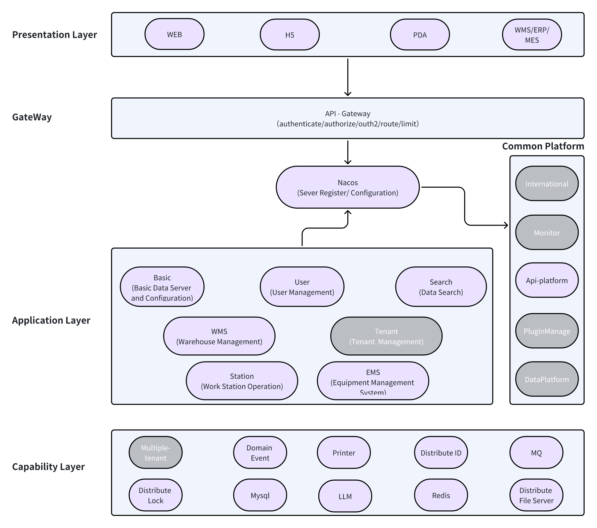

# Architecture Overview

The architecture of OpenWes is DDD(Domain Driver Design) system that designed to support a scalable, modular, and flexible system that integrates various warehouse management and robotic control systems. The system architecture is layered, with clear separation between presentation, application, and capability layers, allowing for easier maintenance and scalability.

### Key Components in the Architecture

#### **1. Presentation Layer**

The presentation layer is responsible for providing access to OpenWes through different interfaces:
- **WEB**: The web interface is used by warehouse operators to interact with OpenWes via a standard web browser.
- **H5**: The mobile web interface, which is optimized for access from mobile devices (smartphones or tablets).
- **PDA**: Devices used by warehouse operators for scanning and managing inventory in the warehouse.
- **WMS/ERP/MES**: Integration with existing Warehouse Management Systems (WMS), Enterprise Resource Planning (ERP), and Manufacturing Execution Systems (MES) for seamless data exchange and management.

#### **2. GateWay Layer**

The Gateway layer acts as the API gateway for OpenWes, performing key tasks such as:
- **Authentication and Authorization**: Ensures secure access to OpenWes by validating user credentials and roles.
- **OAuth2**: Provides secure authorization for third-party applications.
- **Routing**: Directs traffic to the appropriate backend services.
- **Rate Limiting**: Manages the load by limiting the number of requests from users to backend services.

#### **3. Common Platform**

The common platform provides shared services and modules that are used across the system:
- **Nacos**: Manages server registration and configuration, allowing dynamic updates of service configurations.
- **International**: Handles multi-language support and internationalization.
- **Monitor**: Monitors system health, performance, and usage.
- **Api-Platform**: Provides a standardized API framework for integrating with other systems.
- **PluginManage**: Manages plugins that extend OpenWes functionality.
- **DataPlatform**: Integrates with data platforms to manage large datasets and analytics.

#### **4. Application Layer**

The application layer contains core modules that implement specific warehouse management tasks:
- **Basic**: Handles basic data server and configuration management.
- **User**: Manages user accounts and roles, including authentication and permissions.
- **Search**: Provides search functionality for warehouse data such as orders, products, and locations.
- **Tenant**: Manages multi-tenancy for different customers or warehouses using OpenWes.
- **WMS (Warehouse Management System)**: Manages warehouse operations like inventory tracking, order fulfillment, and shipping.
- **Station**: Handles work station operations, including task dispatching and monitoring.
- **EMS (Equipment Management System)**: Manages warehouse equipment, including robots and automated machines.

#### **5. Capability Layer**

The capability layer provides foundational services and technologies that support the entire OpenWes system:
- **Multiple-Tenant Support**: Ensures that OpenWes can serve multiple organizations or customers using the same infrastructure.
- **Domain Events**: Manages event-driven architecture for real-time updates and processing of actions within the warehouse.
- **Distributed Lock**: Ensures that critical operations, such as inventory updates or order assignments, are processed without conflict.
- **MySQL**: The relational database that stores all warehouse data, including orders, inventory, and configurations.
- **LLM**: Supports the integration of language models for natural language processing tasks like query handling.
- **Redis**: Provides caching and session management to speed up data retrieval and reduce the load on the database.
- **Printer**: Manages printing tasks for labels, invoices, and other warehouse documents.
- **Distributed ID**: Generates unique IDs for warehouse operations, ensuring consistency and preventing conflicts.
- **MQ (Message Queue)**: Handles communication between different services asynchronously, ensuring smooth and reliable data flow.
- **Distributed File Server**: Manages the storage and retrieval of large files, such as images, logs, and documents.

---

### **Diagram Visualization**

The following diagram represents the layered architecture of OpenWes:

## Conclusion
The OpenWes architecture is designed for flexibility and scalability, providing a clear separation of concerns between the presentation, application, and capability layers. This modular approach allows OpenWes to integrate seamlessly with a variety of warehouse automation and management systems, supporting real-time processing and a wide range of devices and platforms.

For more advanced configuration options or integration details, check out the Advanced Configuration Guide.
