# OpenWES System Receiving and Picking Process Workflow

In modern warehouse management, the OpenWES system plays a crucial role. In this section, we will walk you through the detailed processes of using the OpenWES system for receiving and picking operations, making warehouse management more efficient and accurate.

## Receiving Process

### Step 1: Login and Select Workstation

Upon logging into the OpenWES system, the first screen displayed is the workstation selection interface. You need to choose the corresponding workstation based on the actual work arrangement. For example, select the "test" workstation. Once selected, click the "Confirm" button to proceed to the next step.

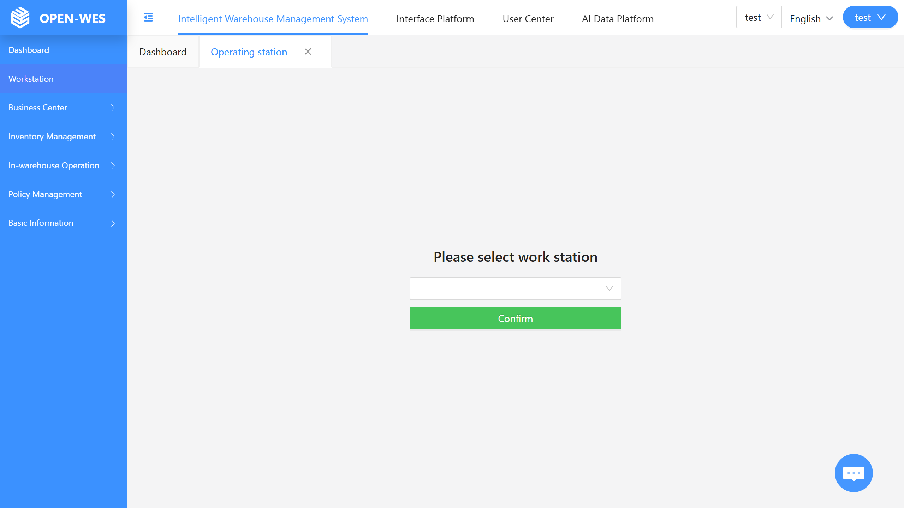

### Step 2: Accessing the Main Operation Interface

After entering the system, the main operation screen is displayed, which offers various functional options such as "Product Receiving," "Picking," and "Inventory Checking." To start the receiving operation, click on the "Product Receiving" function module to begin the receiving process.

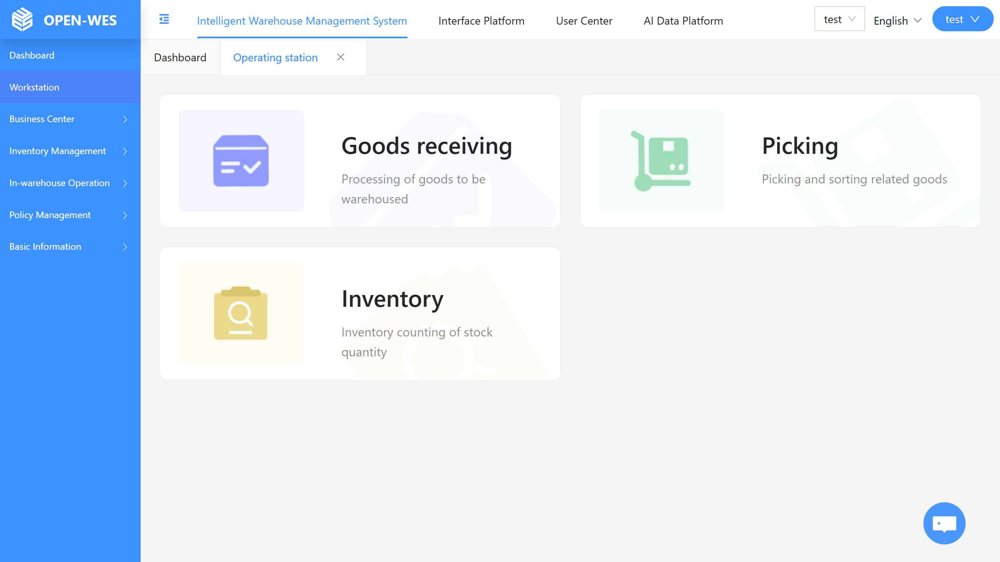

### Step 3: Scanning the LPN Number

After clicking on "Product Receiving," the system prompts you to "Scan the LPN Number." You can either use a scanning device or manually input the LPN number corresponding to the goods. Once entered, click "Confirm" to continue to the next step.

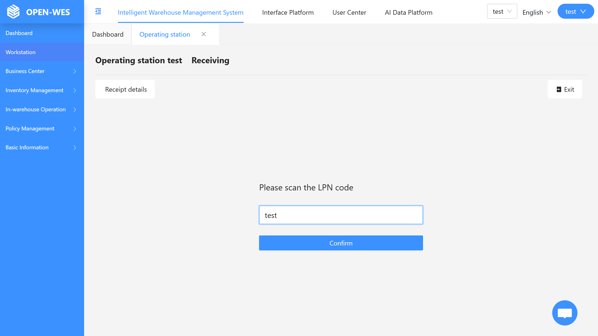

### Step 4: Verify Receiving Information

Next, the system will display the basic receiving information, such as the customer ID, storage type, and other related details. Carefully check if the information is accurate, then scan the product barcode and enter the receiving quantity and other details.

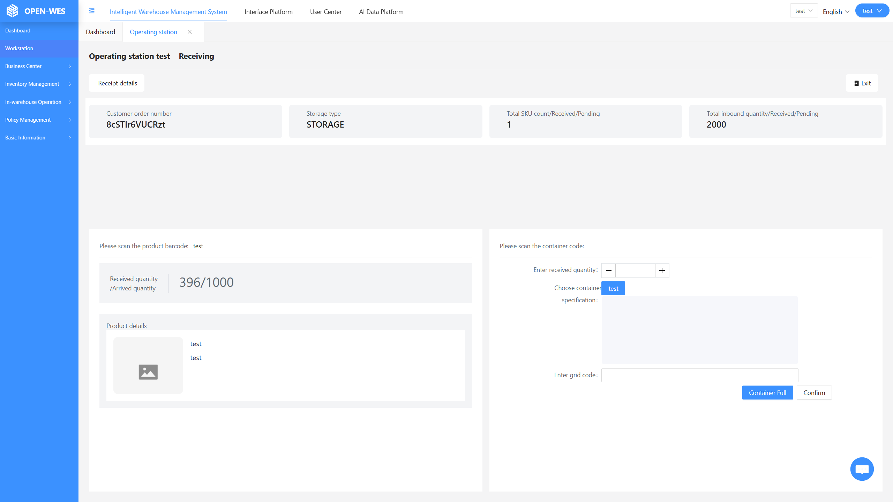![Verify Information](path_to_image_4

### Step 5: Scanning the Bin Number and Confirming SKU Quantity

After confirming the product information, scan the bin number, input the SKU quantity placed in the bin, and select the shelf location. Click the "Confirm" button to complete the SKU receiving. When a bin is full, click the "Full Box" button, indicating that the box is full and can be moved into storage via a robot or other method. This completes the receiving operation for that SKU.

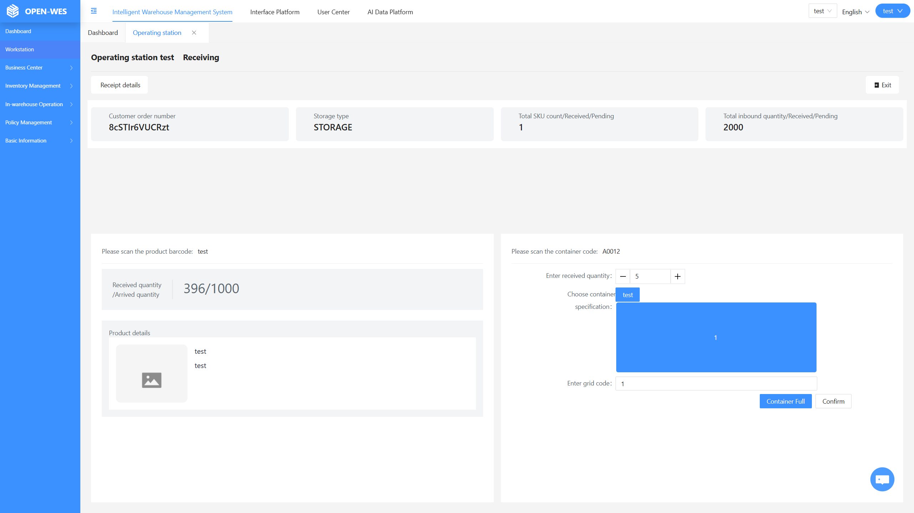

### Step 6: Generate Receiving Details

Once all receiving information has been entered, the system will automatically generate the receiving details. This includes critical information such as the receiving order number, container code, and product code. These details can be used for future reference, management, and traceability. Additionally, you can check the inventory to confirm if the stock has been updated correctly.

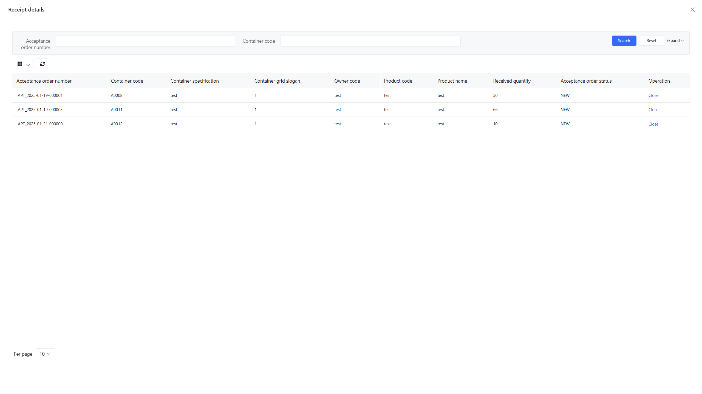

---

## Picking Process

### Step 1: Login and Access the Picking Task

After logging into the OpenWES system and entering the main operation interface, you will see multiple function modules. The "Picking" module is the core entry point for this operation. Click on "Picking" to enter the picking task processing interface and start the picking flow.

### Step 2: Bind Turnover Container to Sowing Wall

Once in the picking task detail page, you will see task information such as the bin code (e.g., A0001) and the number of items to pick (e.g., 10 items). At the bottom of the screen, two blue areas represent the sowing wall. When these areas turn blue, it indicates the need to bind a turnover container to the sowing wall. The operator can scan the sowing wall grid code (e.g., 1) or input it manually using the keyboard, then scan the turnover container number (e.g., Z000003) to complete the binding process.

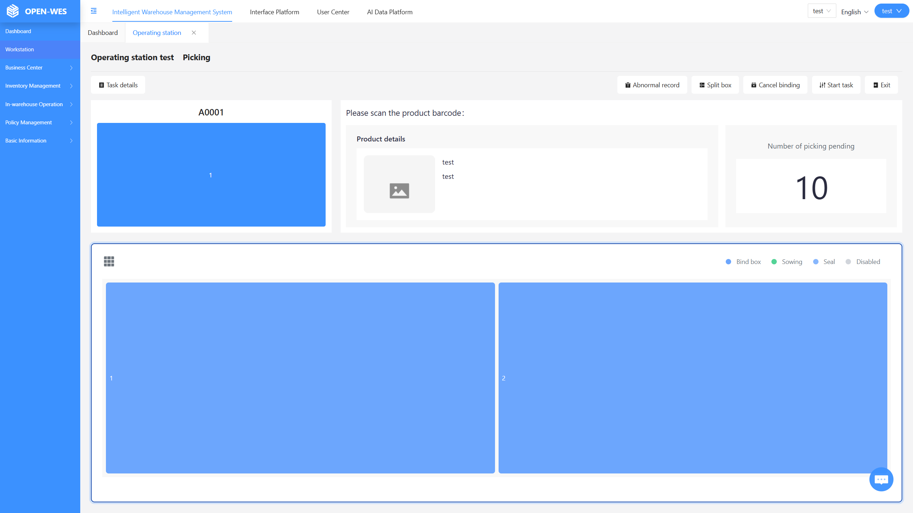

### Step 3: Binding Success and Ready for Picking

After successfully scanning and entering the sowing wall grid code and turnover container number, the corresponding grid (e.g., grid 1) will turn white. This color change visually informs the operator that the sowing wall grid has been successfully bound to the turnover container, and picking can now proceed.

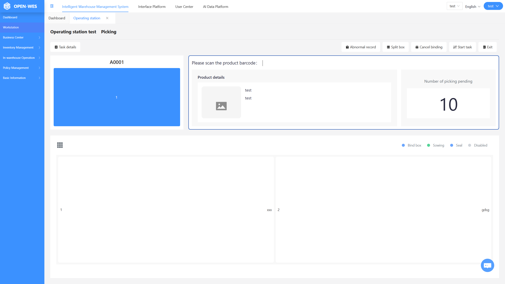

### Step 4: Scan SKU Barcode and Confirm Picking

Next, the operator will scan the SKU barcode of the item. When the SKU barcode is recognized as valid by the system, the corresponding sowing wall grid will immediately turn green. At this point, the operator can click the green grid to confirm that the item has been picked, completing the picking operation for that SKU.

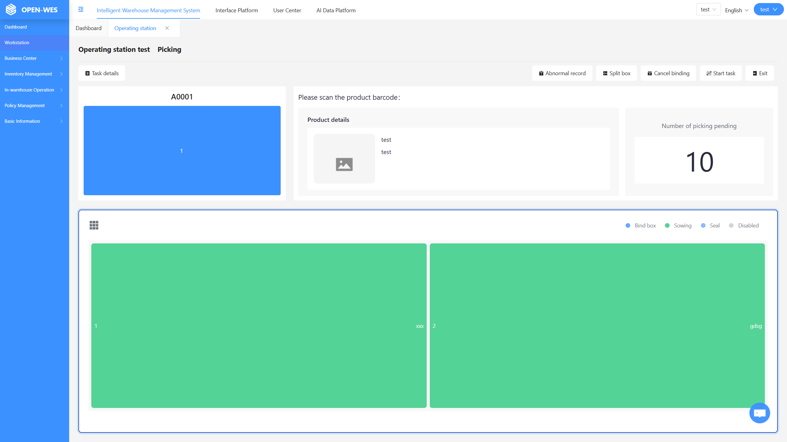

### Step 5: Complete Picking for the Grid

As the operator continues scanning product barcodes, when all items in the current sowing wall grid are picked, the grid will turn blue again. The operator can then click the blue grid or extinguish the sowing light to confirm that the picking task for that order is complete.

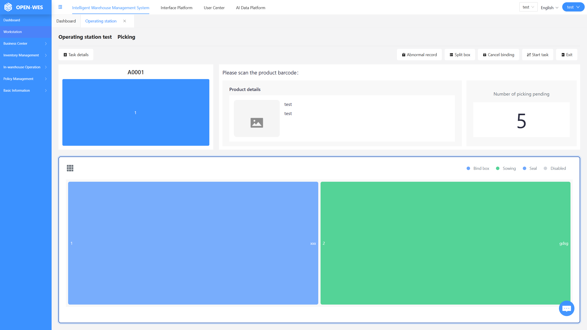

### Step 6: Reset Grid for Next Picking Task

After clicking the blue grid or extinguishing the sowing light, the grid color will return to white. This indicates that the order has been processed and is ready for the next picking operation. The process ensures a smooth and efficient workflow.

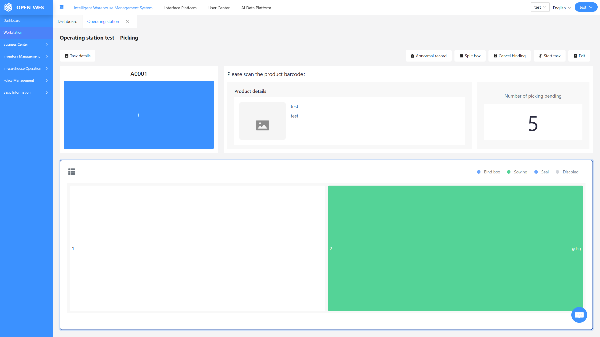
