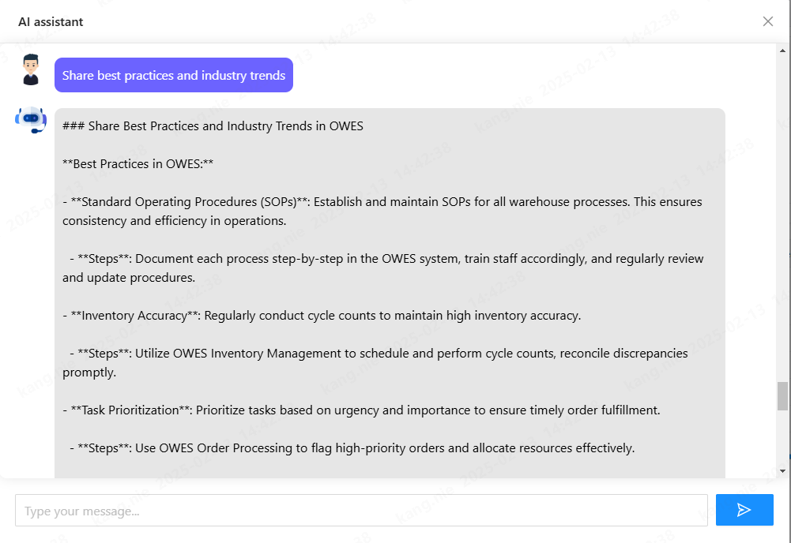

### 引言

随着企业越来越依赖高级数据分析和机器学习来进行决策，将强大的 AI 模型集成到现有系统中变得至关重要。一个这样的强大集成是将 **Spring AI**（一个用于构建 AI 驱动应用程序的框架）与 **DeepSeek**（一个先进的大模型）结合起来。

在本文中，我们将介绍如何将 Spring AI 与 DeepSeek 进行集成，解释关键概念、优势以及如何让这种集成无缝工作的逐步指南。

### 什么是 Spring AI？

[Spring AI](https://spring.io/projects/spring-ai) 是一个框架，允许开发人员利用 Spring 生态系统的强大功能和灵活性来创建 AI 应用程序。它提供了将大型语言模型集成到基于 Spring 的应用程序中的工具和能力，使开发人员能够更轻松地构建和部署 AI 驱动的解决方案，而无需陡峭的学习曲线。

### 为什么将 Spring AI 与 DeepSeek 集成？

将 Spring AI 与 DeepSeek 结合起来，为您的应用程序打开了一个充满可能性的世界，使您能够：

* **访问先进的语言模型**：将 DeepSeek 的最新模型集成到基于 Spring 的应用程序中，增强自然语言理解和生成能力。
* **实时 AI 响应**：结合 DeepSeek 强大的 AI 模型和 Spring 的后端服务，为您的应用程序提供智能、实时的响应。
* **可扩展的 AI 解决方案**：使用 Spring 的强大基础设施和 DeepSeek 的先进语言模型，构建能够随着业务需求扩展的 AI 系统。

### 前提条件

在开始集成过程之前，请确保您具备以下前提条件：

* **Spring Boot**：一个正在运行的 Spring Boot 应用程序，因为 Spring AI 是基于它构建的。
* **[DeepSeek API 密钥](https://platform.deepseek.com/)**：访问 DeepSeek 的 API 以利用其模型和服务。
* **Java 17+**：由于 Spring AI 最适合与 Java 17 及更高版本一起使用。

### 逐步集成指南

#### 第一步：设置您的 Spring Boot 应用程序

如果您还没有设置 Spring Boot 应用程序，可以使用 [Spring Initializr](https://start.spring.io/) 创建一个。选择 **Spring Web**、**Spring Boot DevTools** 和 **Spring AI** 等依赖项。

```
curl https://start.spring.io/starter.zip -d dependencies=web,devtools -d name=SpringDeepSeek -o SpringDeepSeek.zip` 
```

#### 第二步：添加依赖项

在您的 `build.gradle` 文件中，添加 Spring AI 和 DeepSeek 所需的依赖项。对于 Spring AI，使用 `spring-ai-openai-spring-boot-starter` 依赖项。由于 Spring AI 没有专门针对 DeepSeek 的客户端，您可以直接用 OpenAI API 进行交互。

示例：

```
implementation 'org.springframework.ai:spring-ai-openai-spring-boot-starter'
```

#### 第三步：配置 DeepSeek API

要与 DeepSeek 交互，您需要一个 API 密钥。将您的密钥添加到 `application.properties` 或 `application.yml` 中，以便安全访问。

```
spring:
  ai:
    openai:
      base-url: https://api.deepseek.com
      api-key: xxx
      chat:
        options:
          model: deepseek-chat
          temperature: 0
      embedding:
        enabled: false
```

#### 第四步：实现 DeepSeek 集成

创建一个服务，与 DeepSeek 的 API 交互以获取数据洞察。

```
@Service
public class AiChatService {

    private final ChatModel chatModel;

    private Flux<String> executeAI(String message, String conversationId, PromptTemplate template) {

        String relevantHistory = chatMemory.get(conversationId, 10)
                .stream()
                .map(this::formatMessage)
                .collect(Collectors.joining("\n"));

        // 将上下文添加到模板
        template.add("context", relevantHistory);

        chatMemory.add(conversationId, new UserMessage(message));

        // 创建一个 StringBuilder 来累积响应
        StringBuilder fullResponse = new StringBuilder();

        return this.chatModel.stream(template.createMessage()).map(chunk -> {
            fullResponse.append(chunk);
            return chunk;
        }).doOnComplete(() -> {
            // 只有在获得完整响应后才保存到聊天记忆中
            chatMemory.add(conversationId, new AssistantMessage(fullResponse.toString()));
        });
    }
}
```

#### 第五步：结合 Spring AI 和 DeepSeek

现在，将两项服务结合起来，使您的应用程序能够使用 DeepSeek 的洞察并将其应用于您的 AI 模型。

```
@RestController
@RequestMapping("/ai")
public class AIController {

    @GetMapping("chat")
    public Flux<String> chat(@RequestParam(value = "message") String message) {
        String currentUser = UserContext.getCurrentUser();
        return aiService.chat(message, currentUser);
    }

    @PostMapping("analysis")
    @CrossOrigin
    public AnalysisResult sqlAnalysis(@RequestBody AnalysisQueryVO analysisQueryVO) throws SQLException {
        String currentUser = UserContext.getCurrentUser();
        return aiService.analysis(analysisQueryVO.getQuery(), currentUser);
    }

    @PostMapping("generateJsFunction")
    @CrossOrigin
    public Flux<String> generateJsFunction(@RequestBody JsFunctionGenerationRequest jsFunctionGenerationRequest) {
        String currentUser = UserContext.getCurrentUser();
        return aiService.generateJsFunction(jsFunctionGenerationRequest, currentUser);
    }

    @PostMapping("generateCode")
    @CrossOrigin
    public Flux<String> generateCode(@RequestBody CodeGenerationRequest codeGenerationRequest) {
        String currentUser = UserContext.getCurrentUser();
        return aiService.generateCode(codeGenerationRequest, currentUser);
    }
}
```

#### 第六步：测试集成

启动您的 Spring Boot 应用程序，并通过调用 API 端点来测试集成：
```
curl "http://localhost:8080/ai/chat?message=some_data_to_analyze"
```

您应该会收到一个包含 DeepSeek 的数据和您的 AI 模型分析的响应。

#### 第七步：一些使用场景

###### AI 助手：

AI 助手使用 AI 模型根据用户输入提供自动化、实时的响应或洞察。它通过回答问题、提供建议或协助任务来帮助用户，从而提高客户支持或虚拟助手等应用程序的效率。



###### AI 数据分析

AI 数据分析使 AI 模型能够处理和提取大型数据集的洞察。它识别模式和趋势，助力数据驱动的决策。这对于需要快速准确分析数据以获得更好业务成果的应用程序至关重要。


### 结论

将 **Spring AI** 与 **DeepSeek** 集成，为构建能够分析大型数据集、做出实时决策并随着业务需求扩展的 AI 驱动应用程序提供了强大的解决方案。通过这种设置，您可以利用深度学习和机器学习的力量来改进您的仓库执行系统或其他任何数据驱动的应用程序。

您可以在 [GitHub](https://github.com/jingsewu/open-wes) 上进一步探索该项目，并在 **modules-ai** 部分找到更多信息。
或者访问 [OpenWes](https://app.openwes.top) 体验AI 助手 与 数据分析

此外，您可以根据您项目的具体需求，自由定制步骤和使用的模型。
