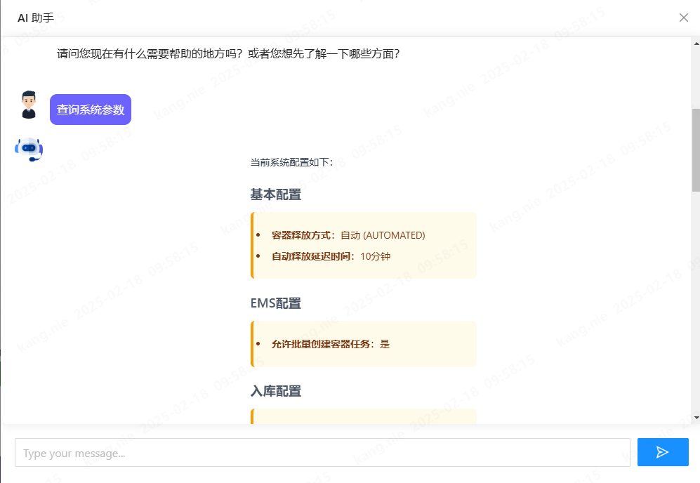
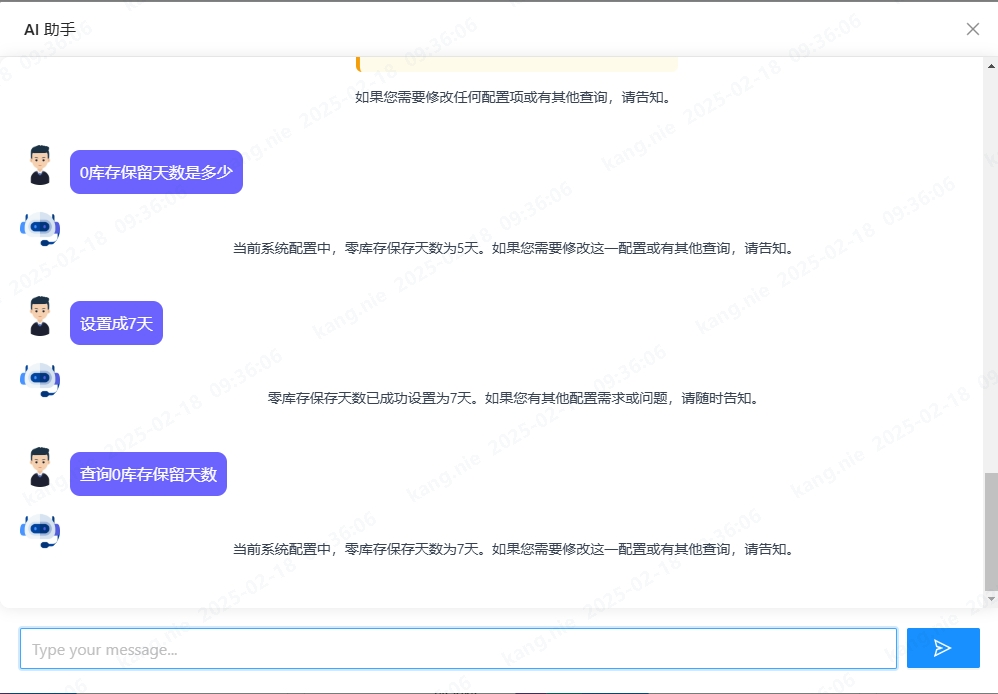

### 引言

系统配置管理通常通过配置文件、环境变量或管理界面来完成。但如果我们可以通过与应用程序聊天来更改系统设置呢？在本文中，我将向您展示如何构建一个能够理解和修改系统配置的聊天机器人，该机器人由 [Spring AI](https://spring.io/projects/spring-ai) 提供支持，并使用自然语言。

## 自然语言配置的强大功能

传统的配置管理要求用户：
*   知道确切的参数名称和有效值；
*   在配置文件或界面中导航；
*   理解技术语法和格式。

通过使用自然语言处理，我们可以使这一过程更加直观。用户可以简单地说：“将连接超时时间增加到 30 秒”或“为身份验证模块启用调试日志”。

## 技术实现

### 设置 Spring AI

参考文章：[集成 SpringAI 与 DeepSeek](./2025-02-14-Integrate-SpringAI-with-DeepSeek.md)

### 定义工具函数

Spring AI 支持工具函数，允许 AI 模型执行特定操作。我们将定义用于读取和更新配置的函数：

```
@Service
@RequiredArgsConstructor
public class SystemConfigTool implements ITool {

    private final ISystemConfigApi systemConfigApi;

    @Tool(name = "getSystemConfig", description = "检索当前系统配置设置，包括基本配置、EMS 配置、入库配置、出库配置、库存配置和算法配置。返回的 {@link SystemConfigDTO} 提供了所有可配置系统参数的全面快照。")
    public SystemConfigDTO getSystemConfig() {
        return systemConfigApi.getSystemConfig();
    }

    @Tool(name = "updateSystemConfig", description = """
            更新系统配置设置，使用以下 JSON 结构：
            {
              "basicConfig": {
                "transferContainerReleaseMethod": "AUTOMATED|MANUAL",  
                "autoReleaseDelayTimeMin": number                       
              },
              "inboundConfig": {
                "checkRepeatedCustomerOrderNo": boolean,  
                "checkRepeatedLpnCode": boolean          
              },
              "outboundConfig": {
                "checkRepeatedCustomerOrderNo": boolean   
              },
              "stockConfig": {
                "stockAbnormalAutoCreateAdjustmentOrder": boolean,  
                "zeroStockSavedDays": number                        
              },
              "emsConfig": {
                "allowBatchCreateContainerTasks": boolean           
              },
              "outboundAlgoConfig": {
                "useLocalAlgorithm": boolean,        
                "cutoffTime": number,                
                "mode": "string",                    
                "orderDispatchStrategy": "string"    
              }
            }
            示例：
            - “禁用入库订单的重复订单检查” → {"inboundConfig":{"checkRepeatedCustomerOrderNo":false}}
            - “将零库存保留期限设置为 3 天” → {"stockConfig":{"zeroStockSavedDays":3}}
            - “同时修改容器释放方法和算法超时时间” → {
                             "basicConfig":{"transferContainerReleaseMethod":"MANUAL"},
                                "outboundAlgoConfig":{"cutoffTime":5000}
                            }
            """)
    public void updateSystemConfig(@ToolParam SystemConfigDTO systemConfigDTO) {
        systemConfigApi.update(systemConfigDTO);
    }
}
```

### 将工具集成到聊天服务中

在聊天服务中处理自然语言：

```
private final List<ITool> tools;

private String executeAIAndReturnString(String message, String conversationId, PromptTemplate template) {

    String relevantHistory = chatMemory.get(conversationId, 10)
            .stream()
            .map(this::formatMessage)
            .collect(Collectors.joining("\n"));

    template.add("context", relevantHistory);

    chatMemory.add(conversationId, new UserMessage(message));

    String content = ChatClient.create(chatModel).prompt(template.create()).tools(tools).call().content();
    chatMemory.add(conversationId, new AssistantMessage(content));

    return content;
}
```

我创建了一个接口 **ITool**，以统一所有Tool class, 这样只需要简单注入，就可以获得所有的Tool class 对象
```java
private final List<ITool> tools;
```

```
@Override
public String chat(String message, String conversationId) {

    PromptTemplate template = new PromptTemplate(AiPromptTemplate.QA_QUESTION_CLARIFY_TEMPLATE);
    template.add("question", message);
    String intent = ChatClient.create(chatModel).prompt(template.create())
            .call().content();

    if ("1".equals(intent)) {
        template = new PromptTemplate(AiPromptTemplate.QA_PROMPT_TEMPLATE);
        template.add("question", message);
        template.add("language", LanguageContext.getLanguage());

    } else {
        template = new PromptTemplate(QA_TOOL_CALL_TEMPLATE);
        template.add("question", message);
        template.add("language", LanguageContext.getLanguage());
    }

    return executeAIAndReturnString(message, conversationId + "chat", template);
}
```

**注意：聊天机器人具有两种功能：首先，它是一个问答机器人；其次，它是一个配置管理机器人。因此，在调用 LLM 之前，需要判断问题是问答查询还是配置管理查询。**

## 示例交互

以下是一些与聊天机器人的示例交互：


我们输入：查询系统参数，系统会自动调用**getSystemConfig**接口，获取参数，并返回


我们输入：设置成7天，系统则调用**updateSystemConfig**接口，修改参数，并返回成功修改

## 安全考虑

在实现此类系统时，请考虑以下安全方面：
1.  身份验证和授权
    *   确保只有授权用户可以访问配置聊天机器人；
    *   为不同配置类别实施基于角色的访问控制。
2.  验证和约束
    *   为配置值添加验证规则；
    *   实施约束，防止修改关键系统设置。
3.  审计日志
    *   记录所有配置更改；
    *   记录谁进行了更改以及更改的时间。

## 优势和用例

这种配置管理方法具有以下优势：
1.  提升用户体验
    *   自然语言交互降低了学习曲线；
    *   用户无需记住确切的配置键；
    *   无需在复杂界面中导航即可快速更改配置。
2.  减少人为错误
    *   AI 可以验证和清理输入；
    *   对无效配置提供即时反馈；
    *   为复杂设置提供引导体验。
3.  适用于 DevOps 和系统管理
    *   在部署期间快速更改配置；
    *   更轻松地进行故障排除和系统维护；
    *   减少文档需求。

## 其他使用函数调用的用例

*   客户支持：自动创建支持工单、获取订单详情或提供常见问题解答。
*   电子商务：推荐产品、处理支付或跟踪发货。
*   医疗保健：安排预约、检索患者记录或发送用药提醒。
*   金融：获取账户余额、执行交易或提供投资见解。

## 结论

通过将 Spring AI 与系统配置管理相结合，我们创建了一种更直观、更用户友好的方式来管理应用程序设置。这种方法展示了 AI 如何简化传统技术任务，并使其对更广泛的受众开放。

该项目的完整源代码可在 GitHub [OpenWES](https://github.com/jingsewu/open-wes) 上找到。欢迎尝试并根据您的需求进行调整！

在将其用于生产环境之前，请务必处理边缘情况、添加适当的错误处理并实施安全措施。
