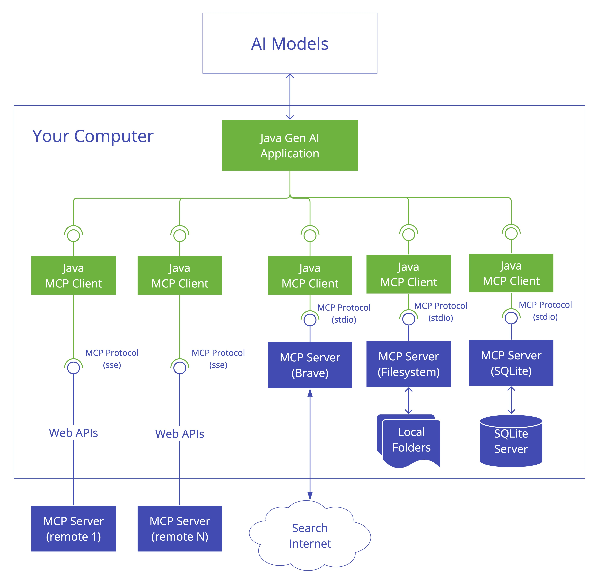
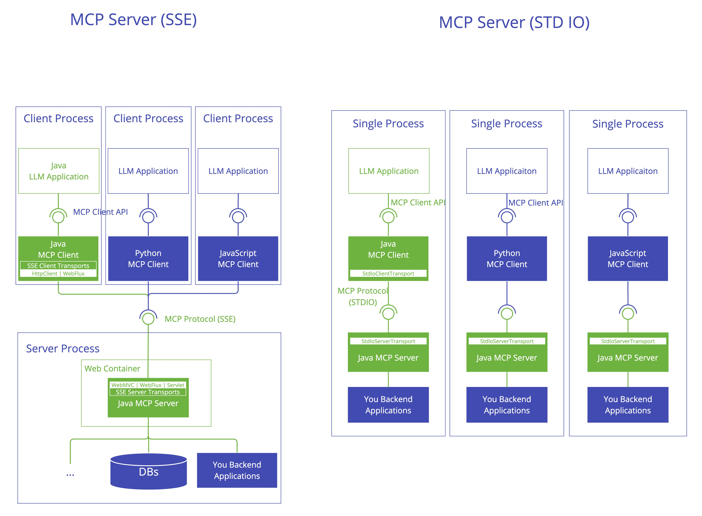

---

### **用模型上下文协议（MCP）和 Spring AI 构建智能应用**

#### **1. MCP 架构介绍**

MCP（模型上下文协议）标准化了人工智能应用与外部数据源之间的交互，使得像数据库、API 和搜索引擎等工具能够无缝集成。其客户端 -
服务器架构包括：

- **MCP 主机**：用户与之交互的人工智能应用层（例如 Claude 聊天机器人）。
- **MCP 客户端**：处理主机与服务器之间的通信，将请求格式化为外部系统可识别的格式。
  
- **MCP 服务器**：连接到外部资源（例如 PostgreSQL、Google Drive）并执行操作的中间件。
  

---

#### **2. 安装 MySQL MCP 服务器**

**第一步：您可以查看这个 GitHub 仓库：
** [GitHub](https://github.com/designcomputer/mysql_mcp_server)** 手动安装

```shell
pip install mysql-mcp-server
```  

**第二步：由于我们将使用 uv 工具，因此需要安装它**  
请参考这篇文章：[UV Installation](https://docs.astral.sh/uv/getting-started/installation/#installation-methods)
安装 uv 工具

#### **3. 使用 Spring AI 进行项目设置**

**第一步：添加依赖项**  
在 `build.gradle` 中包含 Spring AI MCP 库：

```groovy
implementation 'org.springframework.ai:spring-ai-mcp-client-spring-boot-starter'
implementation 'org.springframework.ai:spring-ai-mcp-client-webflux-spring-boot-starter' // 用于 SSE 传输
```  

---

#### **4. 客户端集成**

**第一步：在 application.yml 中配置 Spring AI 配置**

```yaml
spring:
  ai:
    mcp:
      client:
        enabled: true
        name: mysqlMCP # MCP 服务器名称
        version: 1.0.0
        type: SYNC
        request-timeout: 20s
        stdio:
          root-change-notification: true
          servers-configuration: classpath:mcp-servers-config.json # 与 Claude 桌面配置相同的 MCP 服务器配置。
```  

**第二步：添加 mcp-servers-config.json**

```json
{
  "mcpServers": {
    "mysql": {
      "command": "C:\\Users\\xxx\\.local\\bin\\uv.exe",
      "args": [
        "--directory",
        "C:\\Users\\xxx\\AppData\\Local\\Programs\\Python\\Python311\\Lib\\site-packages\\mysql_mcp_server",
        "run",
        "mysql_mcp_server"
      ],
      "env": {
        "MYSQL_HOST": "localhost",
        "MYSQL_PORT": "3306",
        "MYSQL_USER": "root",
        "MYSQL_PASSWORD": "root",
        "MYSQL_DATABASE": "test"
      }
    }
  }
}
```  

需要检查 uv.exe 和 mysql_mcp_server 的目录，并检查所有 MySQL 配置。

---

#### **5. 简单示例**

示例将使用 MCP 与 MySQL 数据库进行交互。

```java

@SpringBootApplication(scanBasePackages = "org.openwes")
@EnableDiscoveryClient
public class AiApplication {

    public static void main(String[] args) {
        SpringApplication.run(AiApplication.class, args);
    }

    private String userInput = "show all tables";

    @Bean
    public CommandLineRunner predefinedQuestions(ChatClient.Builder chatClientBuilder, ToolCallbackProvider tools,
                                                 ConfigurableApplicationContext context) {
        return args -> {

            var chatClient = chatClientBuilder
                    .defaultTools(tools)
                    .build();

            System.out.println(">>> 问题： " + userInput);
            System.out.println(">>> 回答： " + chatClient.prompt(userInput).call().content());

            context.close();
        };
    }

}
```  

然后我们会看到日志显示它将自然语言“show all tables”转换为 SQL“show all tables”：

```shell
received: 2025-03-27 09:21:19,799 - mysql_mcp_server - INFO - Listing tools...

>>> 问题：show all tables

received: 2025-03-27 09:21:20,602 - mysql_mcp_server - INFO - Calling tool: execute_sql with arguments: {'query': 'show all tables'}

>>> 回答：以下是在 MySQL 服务器上执行 `SHOW TABLES` 命令后返回的所有表名：

- a_api
- a_api_config
- a_api_key
- a_api_log
- d_domain_event
- e_container_task
- e_container_task_and_business_task_relation
- e_ems_location_config
- l_change_log
- l_change_log_lock
...
```

#### **6. Spring AI MCP 的优势**

- **声明式工具注册**：通过注解而非手动 SDK 配置简化集成。
- **统一协议**：通过标准化的 MCP 通信消除数据源碎片化。
- **可扩展性**：添加新工具（例如 Meilisearch、Git）而不会干扰现有工作流。

---

#### **7. 结论**

通过结合 Spring AI 的依赖管理与 MCP 的协议标准化，开发人员可以快速构建企业级人工智能应用。对于高级用例，可以探索混合架构，其中
MCP 服务器同时处理实时数据和批处理。

---

本文综合了最新的 MCP 进展与 Spring AI 的相关内容。完整的代码示例请参考链接中的资源。

代码可在 GitHub 上找到：[GitHub - jingsewu/open-wes](https://github.com/jingsewu/open-wes)
