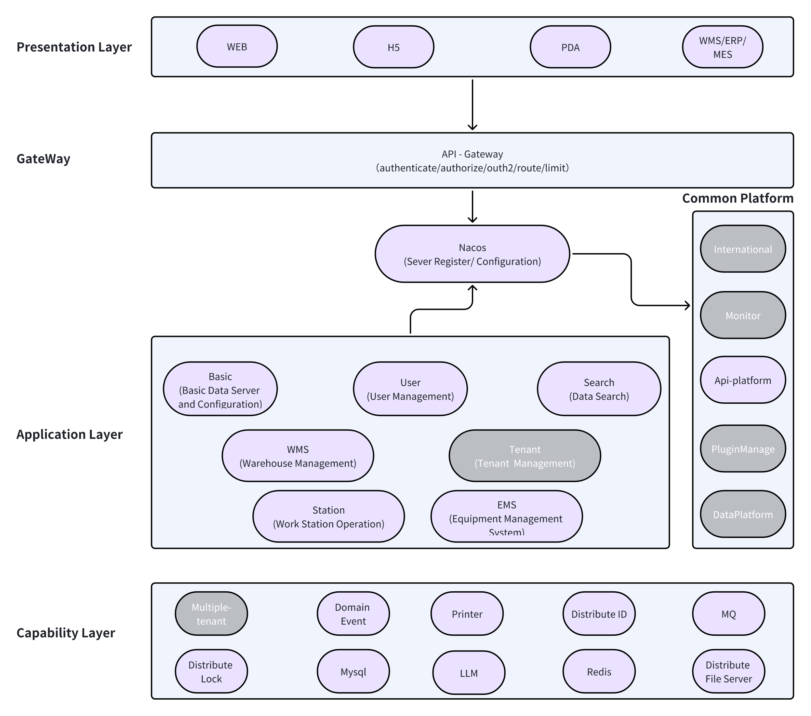

# 架构概览

OpenWes 的架构是一个基于领域驱动设计（DDD）的系统，旨在支持一个可扩展、模块化且灵活的系统，能够整合各种仓库管理和机器人控制系统。系统架构采用分层设计，清晰地分离了表现层、应用层和能力层，便于维护和扩展。

### 架构中的关键组件

#### **1\. 表现层**

表现层负责通过不同接口为 OpenWes 提供访问：

*   **WEB**：网页界面，供仓库操作员通过标准网页浏览器与 OpenWes 交互。

*   **H5**：移动端网页界面，优化了从移动设备（智能手机或平板电脑）访问的体验。

*   **PDA**：仓库操作员用于扫描和管理仓库库存的设备。

*   **WMS/ERP/MES**：与现有的仓库管理系统（WMS）、企业资源规划（ERP）和制造执行系统（MES）集成，实现无缝的数据交换和管理。

#### **2\. 网关层**

网关层作为 OpenWes 的 API 网关，执行以下关键任务：

*   **认证与授权**：通过验证用户凭证和角色，确保对 OpenWes 的安全访问。

*   **OAuth2**：为第三方应用提供安全授权。

*   **路由**：将流量导向适当的后端服务。

*   **速率限制**：通过限制用户对后端服务的请求数量来管理负载。

#### **3\. 公共平台**

公共平台提供系统范围内使用的共享服务和模块：

*   **Nacos**：管理服务器注册和配置，允许动态更新服务配置。

*   **国际化**：处理多语言支持和国际化。

*   **监控**：监控系统健康状况、性能和使用情况。

*   **API 平台**：为与其他系统的集成提供标准化的 API 框架。

*   **插件管理**：管理扩展 OpenWes 功能的插件。

*   **数据平台**：与数据平台集成，管理大数据集和分析。

#### **4\. 应用层**

应用层包含实现特定仓库管理任务的核心模块：

*   **基础模块**：处理基础数据服务器和配置管理。

*   **用户模块**：管理用户账户和角色，包括认证和权限。

*   **搜索模块**：为仓库数据（如订单、产品和位置）提供搜索功能。

*   **租户模块**：管理使用 OpenWes 的不同客户或仓库的多租户。

*   **WMS（仓库管理系统）**：管理仓库操作，如库存跟踪、订单履行和发货。

*   **工作站模块**：处理工作站操作，包括任务分派和监控。

*   **EMS（设备管理系统）**：管理仓库设备，包括机器人和自动化机器。

#### **5\. 能力层**

能力层提供支持整个 OpenWes 系统的基础服务和技术：

*   **多租户支持**：确保 OpenWes 可以为使用同一基础设施的多个组织或客户提供服务。

*   **领域事件**：管理事件驱动架构，实现实时更新和处理仓库内的操作。

*   **分布式锁**：确保关键操作（如库存更新或订单分配）无冲突地进行。

*   **MySQL**：存储所有仓库数据（包括订单、库存和配置）的关系型数据库。

*   **LLM**：支持集成语言模型，用于处理自然语言查询等任务。

*   **Redis**：提供缓存和会话管理，加快数据检索速度，减轻数据库负载。

*   **打印机**：管理标签、发票和其他仓库文件的打印任务。

*   **分布式 ID**：为仓库操作生成唯一 ID，确保一致性并防止冲突。

*   **消息队列（MQ）**：异步处理不同服务之间的通信，确保数据流顺畅且可靠。

*   **分布式文件服务器**：管理大文件（如图像、日志和文档）的存储和检索。

* * *

### **架构图可视化**

以下图表展示了 OpenWes 的分层架构： 

## 总结

OpenWes 的架构设计注重灵活性和可扩展性，表现层、应用层和能力层之间实现了清晰的职责分离。这种模块化方法使 OpenWes 能够无缝集成各种仓库自动化和管理系统，支持实时处理以及广泛的设备和平台。

如需了解更多高级配置选项或集成细节，请查看高级配置指南。
