# OpenWES 系统收货与拣选流程

在现代仓库管理中，OpenWES 系统发挥着关键作用。在本节中，我们将详细介绍如何使用 OpenWES 系统进行收货和拣选操作，使仓库管理更加高效和准确。

## 收货流程

### 第一步：登录并选择工作站

登录 OpenWES 系统后，首先显示的是工作站选择界面。您需要根据实际工作安排选择对应的工作站。例如，选择“test”工作站。选择完成后，点击“确认”按钮进入下一步。

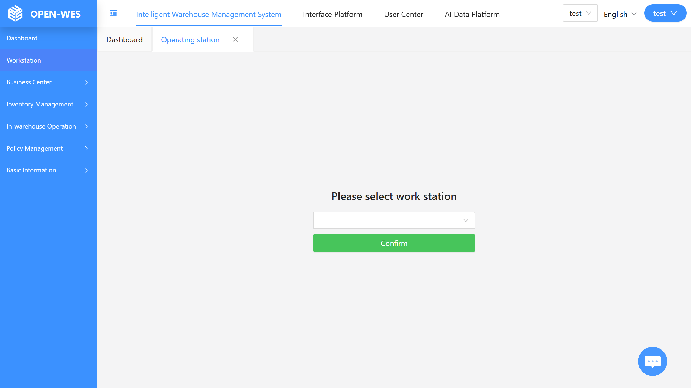

### 第二步：进入主操作界面

进入工作站界面后，页面提供“商品收货”、“拣选”和“库存盘点”等多种功能选项。要开始收货操作，请点击“商品收货”功能模块，开始收货流程。

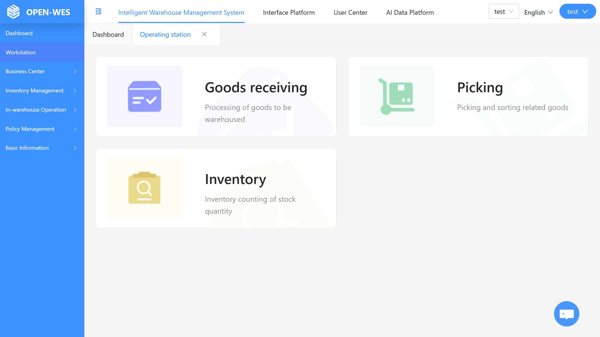

### 第三步：扫描 LPN 编号

点击“商品收货”后，系统会提示您“扫描 LPN 编号”。您可以使用扫描设备或手动输入与货物对应的 LPN 编号。输入完成后，点击“确认”按钮进入下一步。

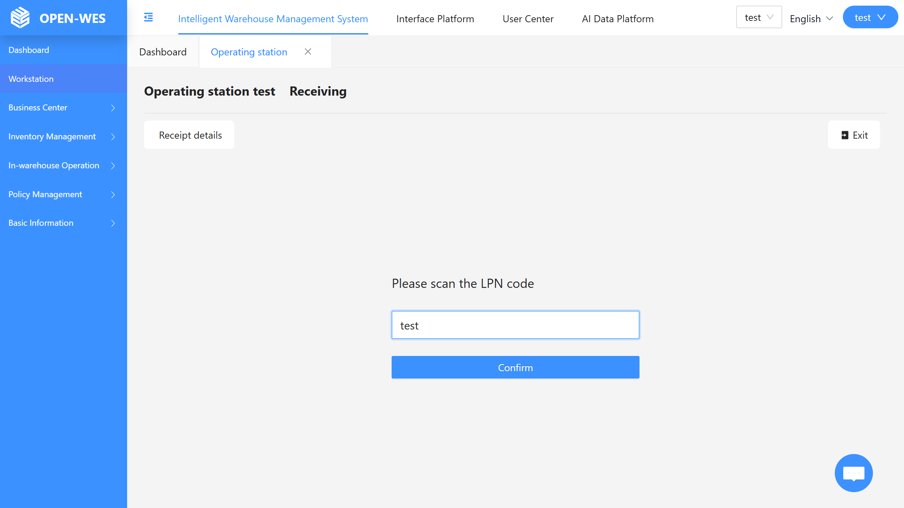

### 第四步：核对收货信息

接下来，系统将显示基本的收货信息，如客户编号、存储类型及其他相关细节。仔细核对信息是否准确，然后扫描商品条码并输入收货数量及其他详细信息。

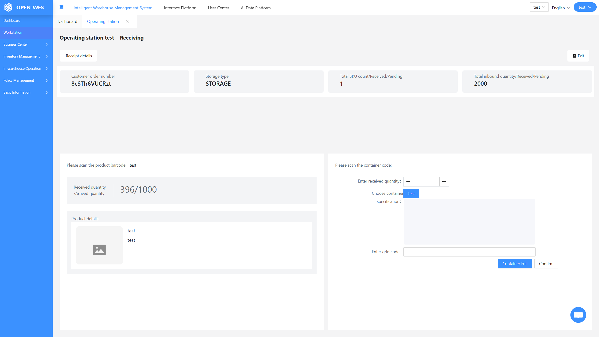

### 第五步：扫描容器编号并确认 SKU 数量

确认商品信息后，扫描容器编号，输入放入货位的 SKU 数量，并选择货架位置。点击“确认”按钮完成该 SKU 的收货。当货位装满时，点击“满箱”按钮，表示该箱已满，可通过机器人或其他方式移入存储区。这完成了该 SKU 的收货操作。

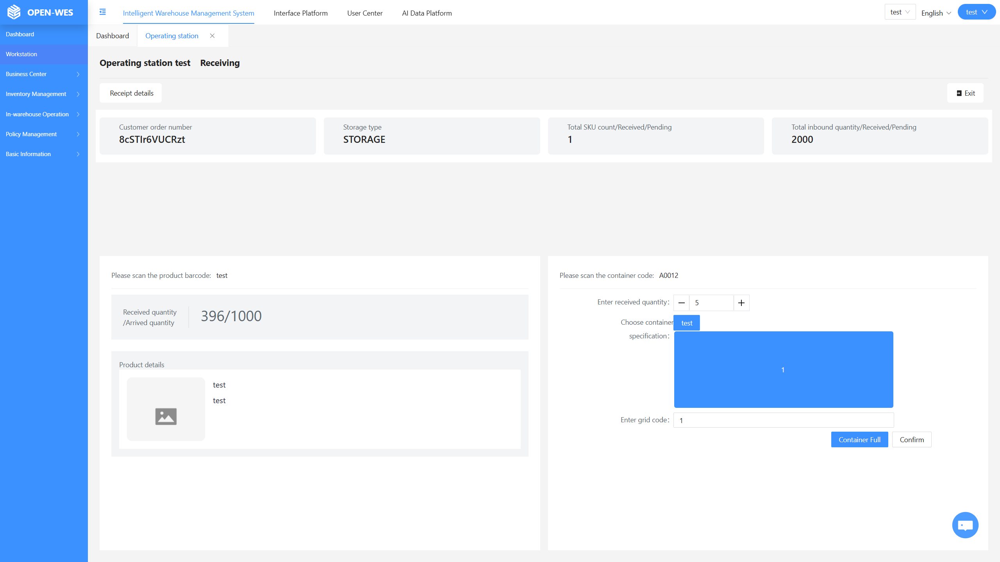

### 第六步：生成收货明细

点击“确认”后，系统将自动生成收货明细，包括收货单号、容器编码和商品编码等关键信息。这些明细可用于未来的参考、管理和追溯。
此外，在点击“满箱”后，您还可以查看库存，确认库存是否已正确更新。

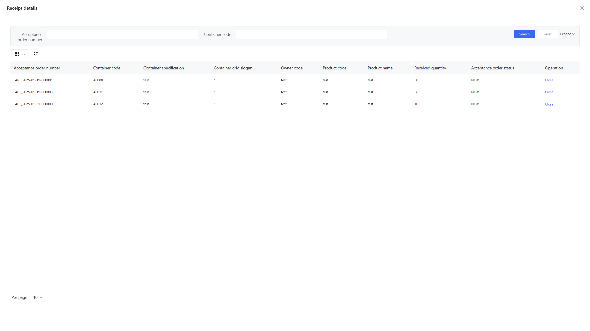

* * *

## 拣选流程

### 第一步：登录并进入拣选任务

登录 OpenWES 系统并进入工作站操作界面后，您将看到多个功能模块。点击“拣选”进入拣选任务处理界面，开始拣选流程。

### 第二步：绑定周转容器至播种墙

进入拣选任务详情页面后，您将看到任务信息，如容器编号（例如 A0001）和需拣选SKU的信息（例如拣选SKU: test 数量：10 ）。屏幕底部的两个蓝色区域代表播种墙。当这些区域变为蓝色时，表示需要将周转容器绑定到播种墙。操作员可以扫描播种墙格口编号（例如 1）或使用键盘手动输入+回车，然后扫描周转容器编号（例如 Z000003）以完成绑定过程。

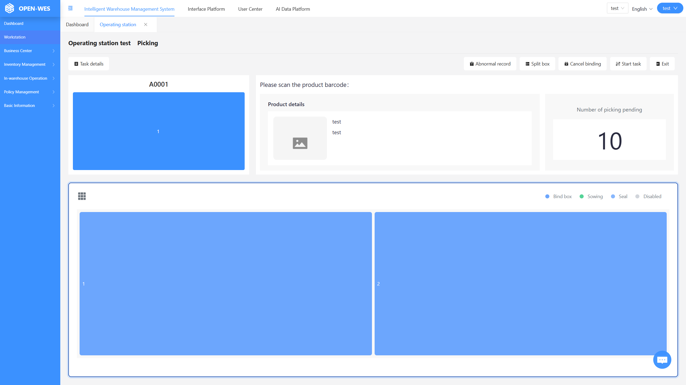

### 第三步：绑定成功并准备拣选

成功扫描并输入播种墙格口编号和周转容器编号后，对应的格（例如格 1）将变为白色。这种颜色变化直观地告知操作员播种墙格已成功绑定到周转容器，现在可以开始拣选。

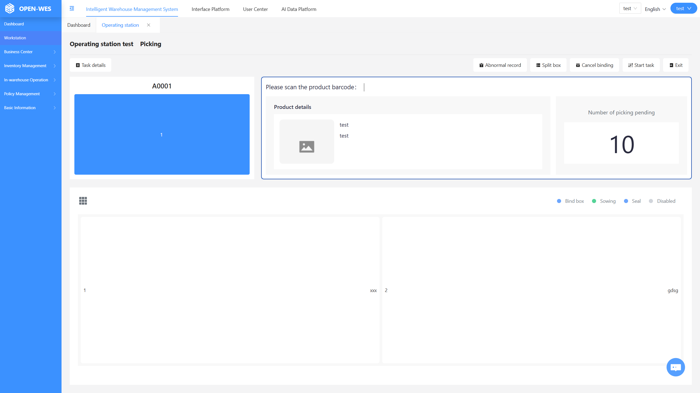

### 第四步：扫描 SKU 条码并确认拣选

接下来，操作员将扫描商品的 SKU 条码。当系统识别 SKU 条码有效时，对应的播种墙格将立即变为绿色。此时，操作员可以点击绿色格确认该商品已被拣选，完成该 SKU 的拣选操作。

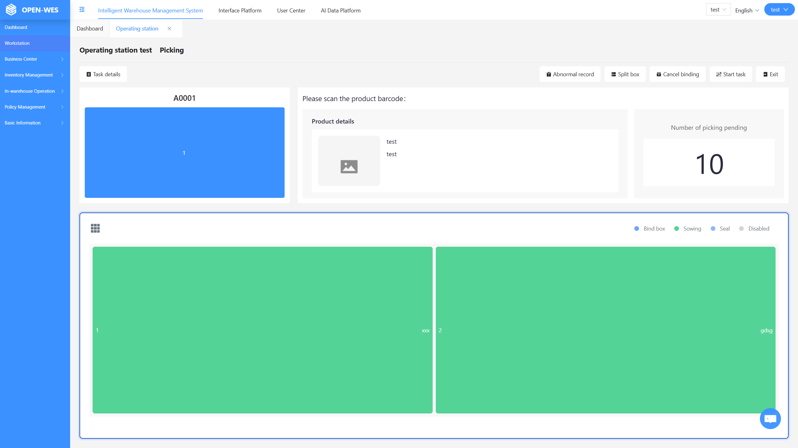

### 第五步：完成该格的拣选

随着操作员继续扫描商品条码，当当前播种墙格口内的所有商品都被拣选后，该格口将再次变为蓝色闪烁。操作员可以点击蓝色格或熄灭播种灯，确认该订单的拣选任务已完成。

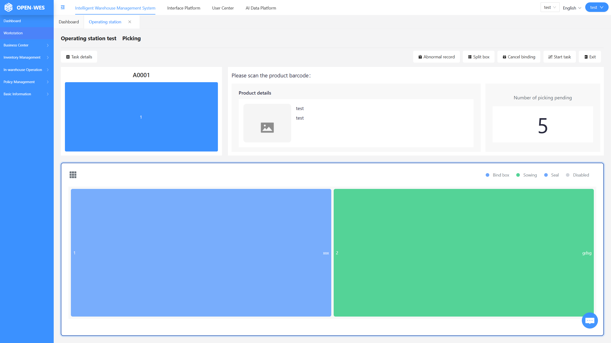

### 第六步：重置格以进行下一个拣选任务

点击蓝色格口或熄灭播种灯后，格口的颜色将恢复为白色。这表明该订单已处理完毕，准备进行下一个拣选操作。该流程确保了顺畅高效的作业流程。

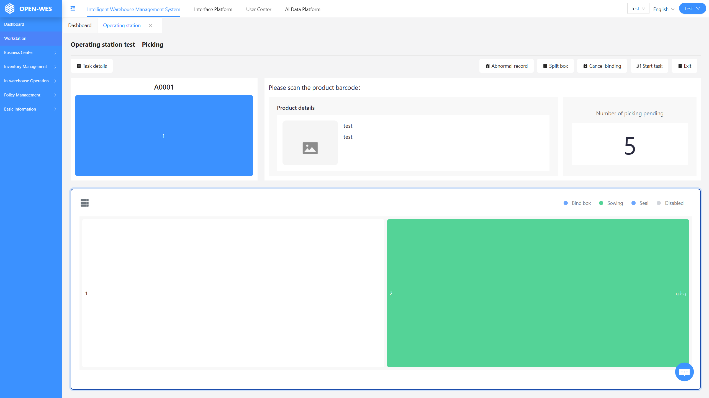
